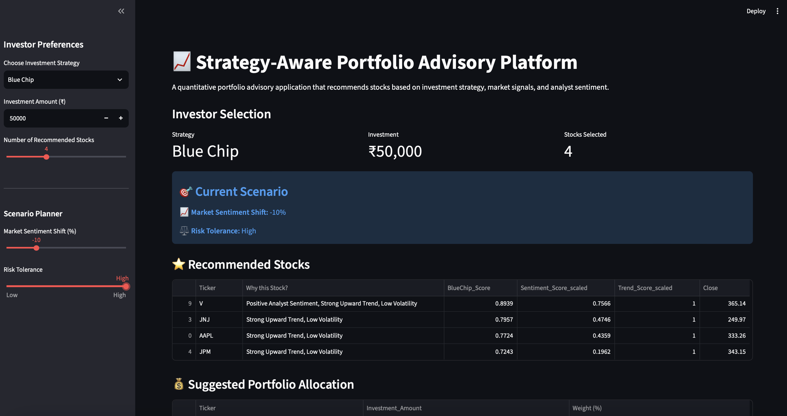
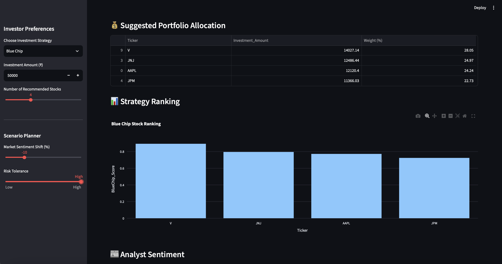
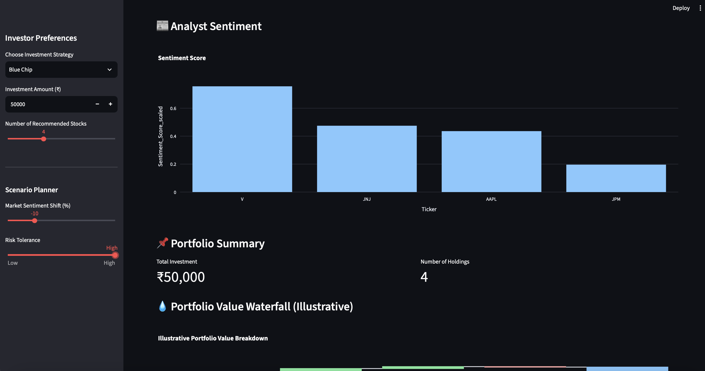
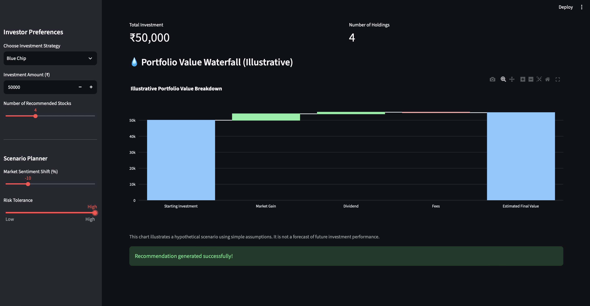

# 📈 Strategy-Aware Portfolio Advisory Platform

A quantitative finance and data science application that recommends personalized stock portfolios based on investment strategy, market indicators, and analyst sentiment.

Built using **Python**, **Pandas**, **Plotly**, and **Streamlit**, this project demonstrates how financial analytics and data-driven decision-making can be combined into an interactive portfolio advisory application.

---

# 🚀 Project Overview

Investors often need to compare multiple stocks using historical performance, market trends, volatility, and analyst opinions before making investment decisions.

This project addresses that challenge by building a **Strategy-Aware Portfolio Advisory Platform** that analyzes financial data, calculates strategy-specific scores, and recommends personalized portfolios based on the investor's preferences.

Unlike traditional stock screeners, the application adapts recommendations according to different investment strategies and allows users to perform simple scenario analysis.

The platform is designed as a **decision-support tool** for educational and analytical purposes. It does **not** execute trades or provide financial advice.

---

# 🎯 Objectives

- Analyze historical stock market data.
- Generate financial indicators through feature engineering.
- Incorporate analyst sentiment into stock evaluation.
- Recommend stocks using strategy-specific scoring models.
- Construct a score-weighted investment portfolio.
- Provide an interactive dashboard for portfolio exploration.

---

# ✨ Features

### 📊 Financial Data Analysis

- Historical stock price analysis
- Daily return calculation
- Moving averages (MA20 & MA50)
- Volatility analysis
- Momentum calculation

---

### 📈 Strategy-Based Recommendation Engine

Supports four investment strategies:

- Growth Investing
- Blue Chip Investing
- Dividend Income Investing
- Balanced Portfolio

Each strategy uses a customized scoring model based on financial indicators and analyst sentiment.

---

### 😊 Analyst Sentiment Integration

The recommendation engine incorporates analyst recommendation data to improve stock evaluation.

Sentiment scores are normalized and combined with technical indicators.

---

### ⚖️ Score-Weighted Portfolio Allocation

Instead of allocating equal investment to every stock, the application distributes investment proportionally according to the calculated strategy scores.

---

### 🎛️ Scenario Planner

Users can simulate different investment scenarios by adjusting:

- Market Sentiment Shift
- Risk Tolerance
- Investment Amount

Recommendations and portfolio allocation update dynamically based on the selected scenario.

---

### 💡 Explainable Recommendations

Each recommended stock includes a short explanation describing the key factors influencing its recommendation, improving transparency and interpretability.

---

### 📊 Interactive Visualizations

The dashboard includes:

- Strategy Ranking Chart
- Analyst Sentiment Chart
- Portfolio Allocation
- Portfolio Summary
- Waterfall Chart (Illustrative)

---

# 🧠 Methodology

The project follows an end-to-end data science workflow:

```
Historical Stock Data
        │
        ▼
Data Cleaning
        │
        ▼
Feature Engineering
        │
        ▼
Analyst Sentiment Integration
        │
        ▼
Feature Scaling
        │
        ▼
Strategy Scoring
        │
        ▼
Scenario Analysis
        │
        ▼
Stock Ranking
        │
        ▼
Portfolio Allocation
        │
        ▼
Interactive Dashboard
```

The data pipeline (download → sentiment → feature engineering → scoring) is implemented as a standalone, reusable module in `src/pipeline.py`. It can be run independently of the dashboard:

```bash
python src/pipeline.py
```

This regenerates `Data/latest_stock_features.csv`, which the Streamlit app then reads from — keeping data processing and the UI cleanly separated.

---

# 🛠 Technology Stack

| Category | Technologies |
|----------|--------------|
| Programming | Python |
| Data Processing | Pandas, NumPy |
| Visualization | Plotly, Matplotlib |
| Machine Learning | Scikit-learn |
| Financial Data | yFinance, Finnhub |
| Dashboard | Streamlit |
| Development | Jupyter Notebook, VS Code |

---

# 📁 Project Structure

```
strategy-aware-portfolio-advisory-platform/

│
├── Data/
│   ├── latest_stock_features.csv
│   ├── sentiment_data.csv
│   └── stock_prices.csv
│
├── Notebooks/
│   └── Strategy_Aware_Portfolio_Advisory_Platform.ipynb
│
├── Outputs/
│   ├── recommended_portfolio.csv
│   ├── performance_metrics.csv
│   ├── portfolio_summary.csv
│   └── portfolio_vs_benchmark.png
│
├── src/
│   ├── app.py         # Streamlit dashboard
│   └── pipeline.py    # Data download, feature engineering, and scoring
│
├── Images/
│
├── .env                # Local only — holds your API key, not committed
├── requirements.txt
├── ReadMe.md
└── LICENSE
```

---

# ▶️ Running the Project

## 1. Clone the repository

```bash
git clone https://github.com/SnehaSathyavati/Strategy-Aware-Portfolio-Advisory-Platform.git
```

---

## 2. Navigate to the project

```bash
cd Strategy-Aware-Portfolio-Advisory-Platform
```

---

## 3. Install dependencies

```bash
pip install -r requirements.txt
```

---

## 4. Set up environment variables

This project uses the [Finnhub API](https://finnhub.io/) for analyst sentiment data. Create a free account to get an API key, then create a `.env` file in the project root:

```
FINNHUB_API_KEY=your_key_here
```

`.env` is excluded from version control via `.gitignore` — never commit your key.

---

## 5. Run the data pipeline

```bash
python src/pipeline.py
```

This downloads the latest price and sentiment data, computes features and strategy scores, and saves the result to `Data/latest_stock_features.csv`.

---

## 6. Launch the dashboard

```bash
streamlit run src/app.py
```

---

# 📷 Dashboard Preview









---

# 📊 Example Output

The application provides:

- Personalized stock recommendations
- Strategy ranking scores
- Portfolio allocation
- Analyst sentiment visualization
- Portfolio summary
- Scenario analysis

---

# ⚠️ Limitations

- Uses historical market data and analyst sentiment for analysis.
- Recommendations are based on heuristic scoring models rather than predictive machine learning.
- Strategy weights are currently set heuristically; a weight-sensitivity comparison is planned to validate their stability.
- The waterfall chart is illustrative and does not represent actual future investment performance.
- The project currently evaluates a selected universe of stocks.

---

# 🚀 Future Improvements

Possible future enhancements include:

- Live market data streaming
- Additional investment strategies
- ETF and mutual fund support
- Portfolio optimization using advanced optimization techniques
- Weight sensitivity / backtesting framework to validate scoring assumptions
- Risk-adjusted performance metrics
- Cloud deployment

---

# 👩‍💻 Author

**Sneha A**

Data Analyst | Data Science | Financial Analytics

LinkedIn:
https://www.linkedin.com/in/sneha-arun-945a08218/

GitHub:
https://github.com/SnehaSathyavati?tab=repositories